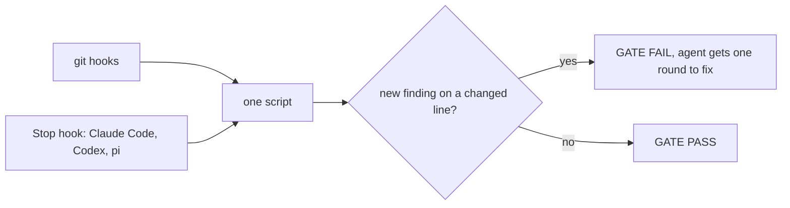

# Code Quality Skill

**Your AI agent made the tests green. Did it fix the code, or the tests?**

A quality gate for coding agents. It runs from git hooks and from the Stop hooks of Claude Code, Codex and pi, blocks test tampering, and holds one complexity bar on every changed function. 12 languages, one config file, no server.


[](https://docs.claude.com/en/docs/agents/agent-skills)
[](LICENSE)
[](scripts/)

## The cheap way out, caught

| The agent | The gate |
|---|---|
| Marked the failing test `it.skip` | `tamper/test-skipped tests/queue.test.ts:12` |
| Dropped two assertions | `tamper/assertion-weakened tests/queue.test.ts:48` |
| Swapped `toEqual` for `toBeTruthy` | `tamper/assertion-weakened tests/queue.test.ts:52` |
| Stubbed the module under test | `note: tamper/mock-added tests/queue.test.ts:+64` |
| Refreshed the baseline with the code | `tamper/baseline-touched baseline.json:1` |
| Shipped 50 lines, 31 covered | `cov/diff: 62% (31/50 lines, minimum 80%)` |

Deterministic. Exit code 1, file and line in the report. No model is asked for an opinion.

## How it works



- **One bar.** Cyclomatic complexity 10, CRAP 30, 80% coverage of added lines, no new cycles, no new dead code, no secrets.
- **Old debt does not block.** A baseline snapshot keeps existing findings as debt. Only new findings on changed lines fail.
- **Seconds, not minutes.** `check` runs in 3-19 s on a real repo. The full gate with tests and coverage is a manual run.
- **Any language.** Complexity from lizard, coverage from lcov, adapters for TypeScript, Python, Go, Rust, Java, Kotlin, C#, Swift, PHP, Ruby, C/C++, Dart.

## Install

```bash
git clone https://github.com/smixs/code-quality-skill ~/.claude/skills/code-quality
bun ~/.claude/skills/code-quality/scripts/quality.ts install-hooks <repo>
bun ~/.claude/skills/code-quality/scripts/quality.ts --repo <repo> --update-baseline
```

Needs [bun](https://bun.sh). Existing hooks keep working. Stop hooks: [references/config.md](references/config.md).

## Docs

- [Every rule, what blocks and what only notes](references/checks.md)
- [Languages and adapters](references/languages.md)
- [Configure `.quality.toml`, git hooks, Stop hooks](references/config.md)
- [Jev: an optional classifier for test hunks](references/jev.md)
- [Evaluation: 6 sabotages, 2 real defects, 0 false blocks](references/evaluation.md)
- [SKILL.md](SKILL.md), the full reference the agent reads

## Credits

CRAP metric by Alberto Savoia and Brian Cunningham. Tamper taxonomy from TRACE (arXiv 2601.20103). Built on lizard, jscpd, ast-grep, gitleaks, osv-scanner, dependency-cruiser, knip, ESLint, Radon and TypeSafe Jev.

MIT. Copyright 2026 Sergey Shima.
