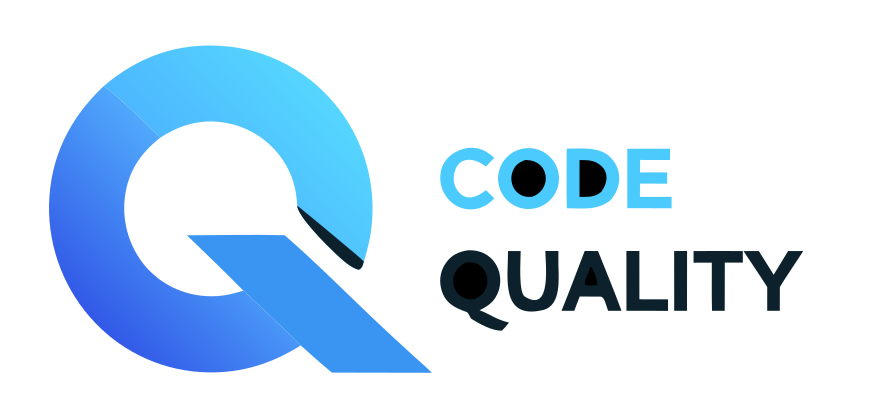
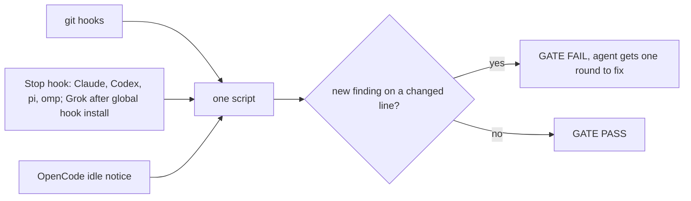

<div align="center">

<picture>
  <source media="(prefers-color-scheme: dark)" srcset="assets/logo-dark.svg">
  
</picture>

# Code Quality

**Your AI agent made the tests green. Did it fix the code, or the tests?**

A quality gate for coding agents: git hooks and Stop hooks that block test tampering and hold one complexity bar on every changed function. 12 languages, one config file, no server.

<p>
  <a href="https://skills.sh/smixs/code-quality"></a>
  <a href="LICENSE"></a>
  <a href="scripts/"></a>
  <a href="https://docs.claude.com/en/docs/agents/agent-skills"></a>
  <a href="hooks/hooks.json"></a>
  <a href="adapters/pi.ts"></a>
  <a href="skills/code-quality/references/jev.md"></a>
</p>

<p>
  
  
  
  
  
  
  
  
  
  
  
  
</p>

</div>


## The cheap way out, caught

| The agent | The gate |
|---|---|
| Marked the failing test `it.skip` | `tamper/test-skipped tests/queue.test.ts:12` |
| Dropped two assertions | `tamper/assertion-weakened tests/queue.test.ts:48` |
| Swapped `toEqual` for `toBeTruthy` | `tamper/assertion-weakened tests/queue.test.ts:52` |
| Stubbed the module under test | `note: tamper/mock-added tests/queue.test.ts:+64` |
| Refreshed the baseline with the code | `tamper/baseline-touched baseline.json:1` |
| Shipped 50 lines, 31 covered | `cov/diff: 62% (31/50 lines, minimum 80%)` |

Deterministic. Exit code 1, file and line in the report. No model is asked for an opinion.

## How it works



- **One bar.** Cyclomatic complexity 10, CRAP 30, 80% coverage of added lines, no new cycles, no new dead code, no secrets.
- **Old debt does not block.** A baseline snapshot keeps existing findings as debt. Only new findings on changed lines fail.
- **Seconds, not minutes.** `check` runs in 3-19 s on a real repo. The full gate with tests and coverage is a manual run.
- **Any language.** Complexity from lizard, coverage from lcov, adapters for TypeScript, Python, Go, Rust, Java, Kotlin, C#, Swift, PHP, Ruby, C/C++, Dart.

## Install

[Bun](https://bun.sh) is required for the gate and the shell hooks. Install for your agent:

| Agent | Install |
|---|---|
| Claude Code | `claude plugin marketplace add smixs/code-quality` then `claude plugin install code-quality@code-quality` |
| Codex | `codex plugin marketplace add smixs/code-quality` then `codex plugin add code-quality@code-quality`; review and trust its hooks with `/hooks` |
| Grok 1.0.40 | `grok plugin install smixs/code-quality --trust`, then from this repository or its installed plugin root run `bun scripts/quality.ts install-grok-hooks` |
| pi | `pi install git:github.com/smixs/code-quality` |
| omp | `omp plugin install github:smixs/code-quality` |
| OpenCode V1 | `bun add github:smixs/code-quality` in a project with `package.json`, then add `"plugin": ["file:./node_modules/code-quality"]` and `"skills": ["./node_modules/code-quality/skills"]` to `opencode.json` |
| OpenCode V2 | Add `"plugins": ["github:smixs/code-quality"]` to `opencode.json` |
| Skill only | `npx skills add smixs/code-quality` (does not install hooks) |

Claude and Codex load [Stop and PreToolUse hooks](hooks/hooks.json) from the plugin. Grok 1.0.40 did not dispatch plugin hooks in a live check (`total_hooks=0`); `install-grok-hooks` writes `~/.grok/hooks/code-quality.json` with both commands pointing to the current plugin root. Run it again after moving or updating that root; `bun scripts/quality.ts uninstall-grok-hooks` removes that file. `$GROK_HOME` overrides the Grok directory. pi and omp load the package extensions. OpenCode blocks the shell tool before a bypass and writes a session message on idle when the gate is red; its idle event cannot force another agent turn. OpenCode V1.18.32 reads the plugin's `config.skills` value but does not discover the skill from it. Add an explicit `"skills": ["./node_modules/code-quality/skills"]` entry to `opencode.json` when using a project Bun installation. In Git repositories with `.quality.toml`, `git commit --no-verify`, `git commit -n`, `git push --no-verify`, `git -c core.hooksPath=...` and `git config core.hooksPath` are blocked by default. Set `[hooks] block_bypass = false` in `.quality.toml` to disable this guard.

To enable the plugin for a team repository, commit these project settings:

```jsonc
// .claude/settings.json
{ "extraKnownMarketplaces": { "code-quality": { "source": { "source": "github", "repo": "smixs/code-quality" } } },
  "enabledPlugins": { "code-quality@code-quality": true } }
// .pi/settings.json
{ "packages": ["git:github.com/smixs/code-quality"] }
// opencode.json (V2)
{ "plugins": ["github:smixs/code-quality"] }
```

For Codex, commit `.codex/config.toml`:

```toml
[plugins."code-quality@code-quality"]
enabled = true
```

Wire each Git repository with a `.quality.toml` and a baseline. From the plugin checkout or installed package root:

```bash
bun scripts/quality.ts install-hooks <repo>
bun scripts/quality.ts --repo <repo> --update-baseline
```

`install-hooks` sets `core.hooksPath` to `~/.local/share/code-quality/git-hooks/`, or `$CODE_QUALITY_HOME/git-hooks/`. A root pointer follows the latest invoked plugin copy. Existing repository hooks are chained. See [configuration](skills/code-quality/references/config.md).

## Jev, optional

Five calibrated yes/no questions about added test hunks (a textual test, an untested error path, a
weakened assertion, a mock that hides the change, a tautological property). Notes only: Jev never
changes the exit code. Two ways to connect, whichever key you have:

```toml
[review]                      # TypeSafe directly, key from console.typesafe.ai/keys
jev = true                    # TYPESAFE_API_KEY in the environment
```

```toml
[review]                      # or through OpenRouter
jev = true                    # OPENROUTER_API_KEY in the environment
jev_provider = "openrouter"
```

Details, the model pins and the curl for each: [Jev reference](skills/code-quality/references/jev.md).

## Docs

- [Every rule, what blocks and what only notes](skills/code-quality/references/checks.md)
- [Languages and adapters](skills/code-quality/references/languages.md)
- [Configure `.quality.toml` and hooks](skills/code-quality/references/config.md)
- [Jev: an optional classifier for test hunks](skills/code-quality/references/jev.md)
- [SKILL.md](skills/code-quality/SKILL.md), the full reference the agent reads

## Credits

CRAP metric by Alberto Savoia and Brian Cunningham. Tamper taxonomy from TRACE (arXiv 2601.20103). Built on lizard, jscpd, ast-grep, gitleaks, osv-scanner, dependency-cruiser, knip, ESLint, Radon and TypeSafe Jev.

MIT. Copyright 2026 Sergey Shima.
