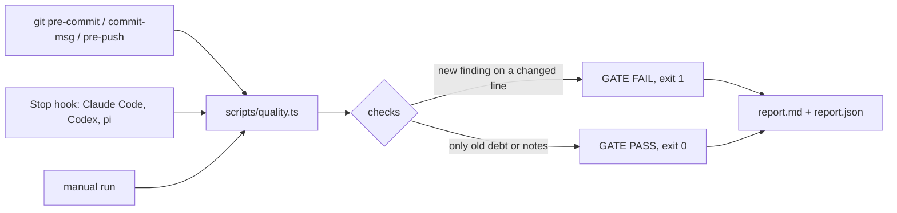

# Code Quality Skill

A quality gate for AI coding agents. Git hooks and Stop hooks for Claude Code, Codex and pi that block test tampering and hold one complexity bar on every changed function.


[](https://skills.sh/smixs/code-quality-skill)
[](https://docs.claude.com/en/docs/agents/agent-skills)
[](LICENSE)
[](scripts/)
[](SKILL.md)

## What it does

- Catches the cheap way out of a red test: a deleted test, a `.skip`, a weakened assertion, a stub instead of the module, a refreshed baseline.
- Holds one bar on changed functions: cyclomatic complexity 10, CRAP 30, 80% coverage of added lines.
- Runs the same script from git hooks, from agent Stop hooks and by hand. One config file per repo. Old debt does not block, new debt does.

## What the agent did, what the gate printed

| The agent | The gate |
|---|---|
| Marked a failing test `it.skip(...)` | `tamper/test-skipped tests/queue.test.ts:12` |
| Dropped two assertions from a hunk | `tamper/assertion-weakened tests/queue.test.ts:48` fewer assertions in hunk |
| Swapped `toEqual` for `toBeTruthy` | `tamper/assertion-weakened tests/queue.test.ts:52` strong assertion replaced with a weak one |
| Stubbed the module under test | `note: tamper/mock-added tests/queue.test.ts:+64` local stub shadows `loadQueueFile` |
| Refreshed `baseline.json` in the same commit as the code | `tamper/baseline-touched .scratch/quality/baseline.json:1` |
| Added 50 lines, 31 of them covered | `cov/diff: 62% (31/50 executable added lines, minimum 80%)` |

Every line is deterministic. Exit code 1, file and line in the report, no model asked for an opinion.

## How it works



Three modes, one bar:

| mode | when | scope | time |
|---|---|---|---|
| `check` | pre-commit, Stop hook | the change | 3-19 s |
| `pre-push` | pre-push | each pushed commit + the tests it touches, by name and by import | 1-39 s |
| full gate | by hand | whole tree with tests and coverage, secrets, dependency audit | 4-6 min |

The baseline is a snapshot of the current findings. After `--update-baseline` only new findings on changed lines fail the run.

## Install

```bash
git clone https://github.com/smixs/code-quality-skill ~/.claude/skills/code-quality
bun ~/.claude/skills/code-quality/scripts/quality.ts install-hooks <repo>
bun ~/.claude/skills/code-quality/scripts/quality.ts --repo <repo> --update-baseline
```

Needs [bun](https://bun.sh) and git. Optional: `brew install gitleaks osv-scanner`. Existing hooks (husky, LFS) keep working. Stop hooks for Claude Code, Codex and pi: [adapters/ENABLE.md](adapters/ENABLE.md).

Minimal `.quality.toml` in the repo root:

```toml
[project]
language = "ts"
src = ["src"]
base = "origin/main"
test_cmd = 'node --test --test-reporter=lcov --test-reporter-destination="$QG_LCOV" "src/**/*.test.ts"'
```

Full examples: [typescript](examples/typescript.quality.toml), [python](examples/python.quality.toml). Every key: [SKILL.md](SKILL.md).

## What blocks

| rule | catches |
|---|---|
| `crap`, `form/*` | changed function with cc > 10, CRAP > 30, cognitive complexity > 15, > 80 lines, > 4 params |
| `cov/diff` | less than 80% of added executable lines covered |
| `tamper/*` | deleted or skipped test, weakened assertion, baseline or thresholds changed with code, no tests ran |
| `deps/cycle`, `dead/*` | new import cycle, new unused export or dependency |
| `dup/jscpd`, `ast/*` | new clone; empty catch, catch that only logs, test asserting on source text |
| `secret/*`, `deps/audit` | tokens, private keys, home paths; new known vulnerability (OSV) |
| `doc/*`, `glossary`, `commit/attribution` | dead path in docs, banned word, `Co-Authored-By: Claude` |

Notes only, exit code unchanged: `tamper/mock-added`, `deps/new-package`, `crap/mean`, everything from Jev. A missing tool prints one `not run` line with the install command.

## Languages

Complexity and coverage come from [lizard](https://github.com/terryyin/lizard) and lcov, so the bar is the same everywhere. TypeScript uses the ESLint AST, Python uses Radon. Cycles and dead code come from a per-language adapter.

| language | detect | adapters |
|---|---|---|
| TypeScript / JavaScript | `package.json` | dependency-cruiser, knip, ESLint + SonarJS |
| Python | `pyproject.toml` | pycycle, vulture, Ruff |
| Go | `go.mod` | `go list`, deadcode, gocyclo |
| Rust | `Cargo.toml` | cargo-modules, cargo-machete, Clippy |
| Java / Kotlin | `pom.xml`, `build.gradle` | jdeps, PMD, detekt |
| C# | `*.csproj` | Roslyn SARIF |
| Swift | `Package.swift` | Periphery, SwiftLint |
| PHP | `composer.json` | deptrac, PHPStan, PHPMD |
| Ruby | `Gemfile` | Packwerk, RuboCop |
| C / C++ | `CMakeLists.txt` | include-what-you-use, clang-tidy |
| Dart | `pubspec.yaml` | dart analyze, dart_code_metrics |

## Jev: a classifier for test hunks

[Jev](https://openrouter.ai/typesafe/jev-1.13-20260917) is a small classifier by TypeSafe. It takes a state and a yes/no question and returns a calibrated probability. The gate sends every added test hunk and asks five questions: is the test textual, is the new error path tested, was an assertion weakened, does a mock hide the behaviour, is the property a tautology.

Jev never blocks. Above the threshold it adds `note: jev assertion_weakened p=0.87 ...` to the report. One request per hunk, at most 12 hunks per change, about 5 s.

```bash
export OPENROUTER_API_KEY=...
```

```toml
[review]
jev = true
```

Default is off. In our evaluation Jev found one real weakening the regexes missed. Turn it on to collect the log in `.scratch/quality/jev-log.jsonl`, not to gate.

## Evaluation

Two executors, Codex GPT-5.6 and Claude Opus 5, six injected sabotages and two real defects on one repository.

- Blocked by the new rules: deleted test, skipped test, weakened assertion (both executors), baseline refresh (one).
- Noted, by design: a local stub instead of the module.
- Real defects: caught by the tests `pre-push` selects by import.
- Clean submission: 0 false blocks in every mode.

## Credits

CRAP metric by Alberto Savoia and Brian Cunningham. Tamper taxonomy from TRACE (arXiv 2601.20103). Tools: lizard, jscpd, ast-grep, gitleaks, osv-scanner, dependency-cruiser, knip, ESLint, Radon, TypeSafe Jev.

MIT. Copyright 2026 Sergey Shima.
